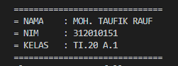

# **tugas ini untuk melengkapi pertemuan ke 6**

**Nama : Moh. Taufik Rauf** <br>
**NIM  : 312010151** <br>
**Kelas : TI.20.A1** <br>
**Tugas : Bahasa Pemrograman** <br>

DAFTAR ISI
| No | Description | Link |
| ----- | ----- | ----- |
| 1 | Tugas Pertemuan 5 | [click here](#pertemuan-5---tugas)
| 2 | Tugas Pertemuan 6 - Lab 1 | [click here](#pertemuan-6---Lab-1)
| 3 | Tugas Pertemuan 6 - Lab 1 dan 2 | [click here](#pertemuan-6---Lab-1-2)

## Pertemuan 5 - Tugas

Pada pertemuan 5 Bahasa Pemrograman saya diberi tugas oleh dosen untuk membuat Aplikasi Biodata Python (Seperti Gambar dibawah ini) <br>


Saat ini saya akan menjelaskan hasil dari tugas tersebut. <br>
Berikut *source code* nya atau Klik Link berikut ([pertemuan_5 python](pertemuan_5.py)): <br>
```python <br>

print("==============================") <br> 
print("= NAMA    : MOH. TAUFIK RAUF  ") <br>
print("= NIM     : 312010151         ") <br>
print("= KELAS   : TI.20 A.1         ") <br>
print("==============================") <br>

`print("Please enter your full name : MOH. TAUFIK RAUF")` <br>
`fullname=input()` <br>
`print("Please enter nickname : TAUFIK")` <br>
`nickname=input()` <br>
`print("Please enter your NPM : 312010151")` <br>
`npm=input()` <br>
`print("Please enter place of birth : GORONTALO")` <br>
`pob=input()` <br>
`print("Please enter date of birth : 19")` <br> 
`date=input()` <br>
`print("Please enter your month of birth : APRIL")` <br>
`month=input()` <br>
`print("Please enter year of birth : 2002") <br>
`year=int(input())` <br>
`print("Please enter your phone number : 082189289710")`
`phone=input()`
`print("Please enter your address : SUKADAMI")`
`address=input()`

`dob=input("2020-year")` <br>

`print("\n\n Assalamu'alaikum. ")` <br>
print("Let me introduce my self, my name is {MOH. TAUFIK RAUF}, but you can call me {TAUFIK}, my NPM {312010151}, I was born in {GORONTALO} and iam {18} years old, I am very glad if you want to invite my house in {Perum.Citra Graha Prima}, So don't forget to call me before with the number {082189289710}, \n\n Thanks you ")


```
Berikut Penjelasannya :<br>

```python
print("please enter your full name : ") <br>
``` <br>
Source code diatas berfungsi untuk mencetak hasil / output berupa **Please enter your full name :** ". <br>
 Untuk menampilkan output string, saya menggunakan *tanda petik dua* didalam fungsi print(), sedangkan jika saya ingin 
menampilkan output atau hasil berupa angka atau interger saya tidak perlu menggunakan *tanda petik dua*. Contohnya : <br>
```python
print("Nama saya adalah...")
print(1234567)
```
(Seperti gambar dibawah ini)<br> 

